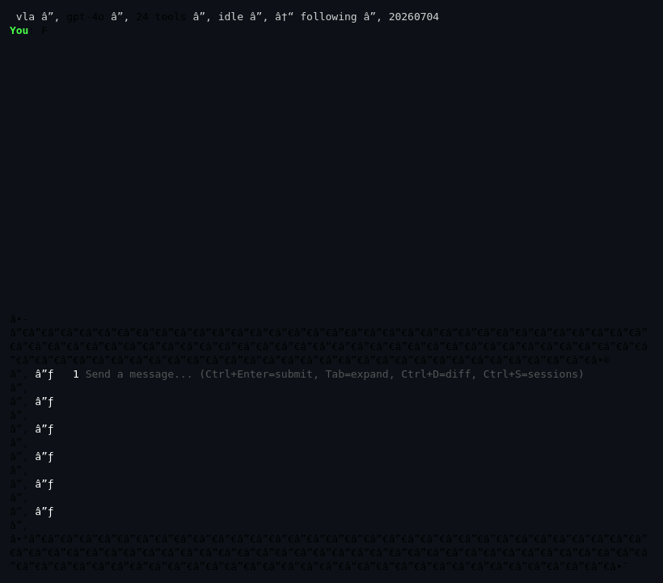
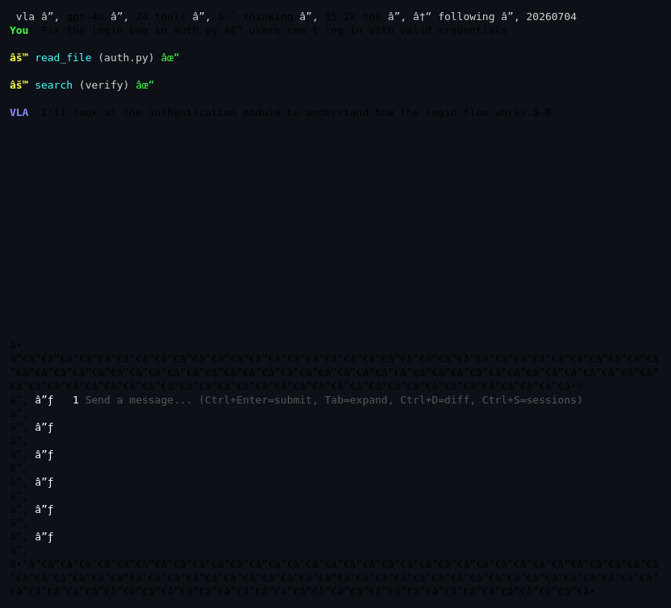
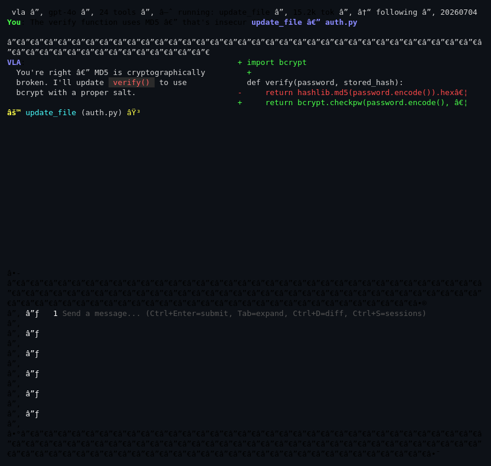
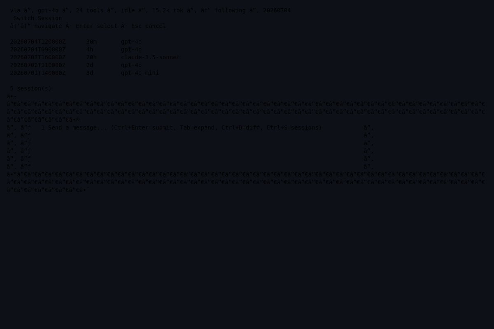

<p align="center">
  
</p>

<h1 align="center">VLA — Very Large Agent</h1>

<p align="center">
  A CLI-based agentic coding harness with persistent memory and LSP-backed code intelligence.<br>
  Named after the <a href="https://en.wikipedia.org/wiki/Very_Large_Array">Very Large Array</a>: multiple tools working together to see deep into a codebase.
</p>

<p align="center">
  <a href="LICENSE"></a>
  
  
</p>

**420 deterministic tests. Full-screen TUI with split-pane diff + session switcher + animated demo. MCP support. LSP integration.**

## What makes VLA different

1. **Full-screen TUI.** A bubbletea terminal interface with markdown rendering, expandable tool-call blocks, split-pane diff preview, session switcher, scroll lock, live status bar (spinner + token count), slash-command autocomplete, and inline approval prompts — like Claude Code or OpenCode.
2. **MCP support.** Connect external tools via Model Context Protocol — same protocol as Claude Code, Cursor, OpenCode. Any MCP server plugs in via `.vla/mcp.json`.
3. **IDE-grade tool space.** 20+ built-in tools: file, search, git, web, memory, navigation, plus unlimited MCP tools.
4. **Persistent memory.** The agent remembers across sessions. Memories are stored per-project with embedding-based semantic search, auto-injected into context before each LLM call.
5. **LSP-backed navigation.** When a language server (gopls, pyright) is available, go-to-definition, find-references, hover, and diagnostics use real LSP. Falls back to a regex-based indexer.
6. **150+ providers.** Auto-configured via models.dev — `vla use openai/gpt-4o` and you're running.
7. **Encapsulated tools.** Every tool is a self-contained Go struct in its own file.

## Quick start

```bash
go build -o vla .

# Option A: Configure with models.dev (auto-discovers 150+ providers)
export OPENAI_API_KEY=sk-...
./vla use openai/gpt-4o       # writes config.json automatically

# Option B: Manual config
cp config.json.example config.json  # edit with your OpenAI-compatible API key
./vla

# Browse available models
./vla models                    # list all providers
./vla models openai             # list OpenAI models
./vla models anthropic claude   # filter by name

# Run the agent
./vla
```

## Built-in tools

| Tool | Description |
|------|-------------|
| **File** | |
| `read_file` | Read file contents (capped at 256 KiB) |
| `write_file` | Create or overwrite a file |
| `update_file` | Find-and-replace within a file |
| `delete_file` | Delete a file |
| `list_files` | List project files |
| `search` | Codebase text search (ripgrep or Go fallback) |
| **Git** | |
| `git_status` | Show working tree status |
| `git_diff` | Show staged or unstaged changes |
| `git_commit` | Stage all + commit |
| **Navigation** | |
| `go_to_definition` | Find where a symbol is defined (LSP or regex) |
| `find_references` | Find all usages of a symbol (LSP or regex) |
| `hover` | Type/signature/docs at a position (LSP only) |
| `diagnostics` | Lint/type errors for a file (LSP only) |
| **Memory** | |
| `memory_save` | Store a fact or knowledge for later |
| `memory_search` | Search stored memories (keyword + semantic) |
| `memory_list` | List all memories for the current project |
| `memory_delete` | Delete a memory by ID |
| **Web** | |
| `web_search` | Search the web (DuckDuckGo, no API key) |
| `web_read` | Fetch a URL, strip HTML to text |

## MCP (external tools)

VLA supports any MCP server via `.vla/mcp.json`:

```json
{
  "servers": {
    "github": {
      "command": "npx",
      "args": ["-y", "@modelcontextprotocol/server-github"],
      "env": {"GITHUB_TOKEN": "ghp_xxx"}
    }
  }
}
```

On launch, VLA starts all MCP servers, performs the handshake, and registers their tools alongside the built-in tools. MCP tools are prefixed with the server name (e.g. `github__create_issue`) to avoid collisions. See `.vla/mcp.json.example` for more.

## TUI (terminal interface)

When launched in a terminal, VLA uses a full-screen bubbletea interface:



<details>
<summary>Static screenshots</summary>



<details>
<summary>Diff preview (auto-shows on file edits)</summary>


</details>

<details>
<summary>Session switcher (Ctrl+S)</summary>


</details>

</details>

Key bindings:
- **Ctrl+Enter** (or **Ctrl+J**): submit input
- **Tab**: expand/collapse tool call details
- **Ctrl+D**: toggle split-pane diff preview
- **Ctrl+S**: open session switcher
- **Ctrl+F**: toggle auto-scroll follow mode
- **Ctrl+C**: quit
- Arrow keys / Page Up/Down: scroll conversation history
- When stdin is piped (`echo "fix bug" | vla`), falls back to readline/plain mode


```
main.go                  → subcommand routing (models, use, default=agent)
tui_runner.go            → full-screen TUI launcher (bubbletea)
input.go                 → readline wrapper (fallback UI)
internal/agent/          → core loop + message types + context injection
internal/tui/            → bubbletea TUI (conversation, streaming, input)
internal/mcp/            → MCP client + tool adapter + server manager
internal/llm/            → OpenAI-compatible streaming client (SSE)
internal/lsp/            → LSP client (JSON-RPC) + process manager
internal/memory/         → persistent memory store + embeddings + hybrid search
internal/modelsdev/      → models.dev catalog client + CLI commands
internal/session/        → session lifecycle + NDJSON transcript
internal/indexer/        → regex symbol index + polling watcher
internal/tools/builtin/  → all 20 built-in tools (one file each)
internal/compaction/     → context-window compaction
internal/fsutil/         → path confinement
internal/app/            → wiring (config discovery, tool registration, resume)
internal/config/         → config.json loader
```

## Memory system

Memories are stored as JSON files under `~/.vla/memory/<project>/`. Each memory carries content, tags, and an embedding vector (via the OpenAI embeddings API). Search is hybrid: keyword (substring on content/tags) fused with vector cosine similarity, min-max normalized and weighted (0.7 vector / 0.3 keyword).

Before each LLM call, the agent searches memories relevant to the current user message and injects them as a system message — so the agent has context from all previous sessions without being told.

## LSP integration

When a language server is installed (gopls for Go, pyright for Python), VLA uses it for:
- `go_to_definition` — position-aware, not just name matching
- `find_references` — precise, not heuristic
- `hover` — type signatures, documentation
- `diagnostics` — compile/lint errors with severity

If no server is available, navigation falls back to the regex-based indexer. The LSP client speaks the base protocol (Content-Length framing) over stdio, with a warm process pool (one server per language + workspace).

## Testing

```bash
go test ./...        # 142 tests, ~10 seconds
```

All tests are deterministic — no API keys, no real network, no LSP servers required. LLM interactions use `httptest.NewServer`; LSP client tests use `net.Pipe` to simulate a server in-process.
